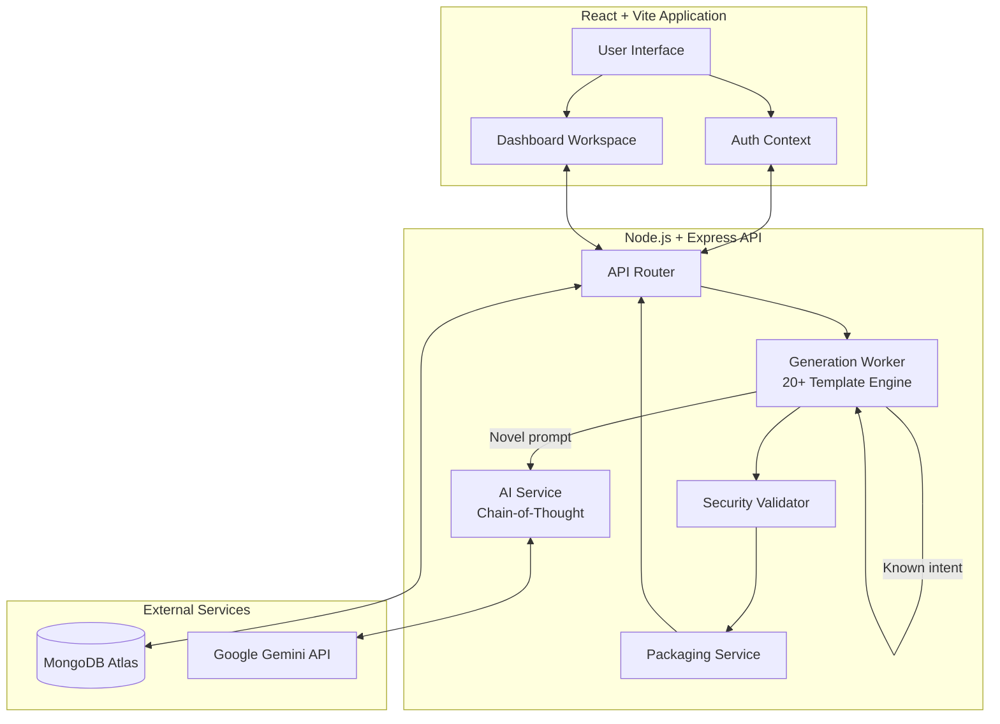
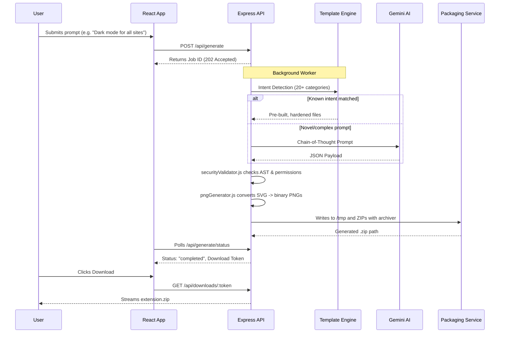

<div align="center">
   
   <h1>Extensio.ai - The No Code Extension Factory</h1>
   <h3>Empowering Creators to Build Browser Extensions with AI</h3>
</div>

<p align="center">
  <a href="https://extensio-ai.vercel.app/">
    
  </a>
  <a href="https://extensio-ai.netlify.app/">
    
  </a> <br>
  
  
  
  
  
  
  
</p>

---

## 📖 Introduction

**Extensio.ai** is a revolutionary SaaS platform that completely democratizes browser extension development. It eliminates the coding barrier by transforming simple natural language descriptions into fully functional, packaged, and immediately installable Chrome Manifest V3 extensions in seconds — no coding knowledge required.

A business user simply types: *"Make a Chrome extension that blocks all images and replaces them with a red square"* — and within seconds, a ready-to-install `.zip` file is generated and downloaded.

---

## 🆕 What's New (Latest Update)

### 🐛 Critical Bug Fix — Extensions Now Actually Work
**Previously:** Every generated extension's `popup.js` was silently crashing with a `SyntaxError: Identifier 'toggle' has already been declared`. The toggle button opened but did nothing.

**Fixed:** The duplicate `const` variable declaration was removed from the shared `toggleJs` helper. All generated extensions now correctly apply their action the moment you click the toggle — no page reload required.

### ✅ New Extension Categories Added
The generation engine now supports **20+ distinct extension types** with full intent detection:

| Category | Trigger Words |
|---|---|
| 🟥 Image Blocker | `image`, `picture`, `photo`, `block`, `hide`, `replace`, `red square` |
| 🎬 Video Blocker | `video`, `youtube`, `reel`, `film`, `block`, `hide`, `stop` |
| 🍪 Cookie Dismisser | `cookie`, `gdpr`, `consent`, `banner`, `accept cookie` |
| 🚫 Popup Blocker | `popup`, `modal`, `overlay`, `paywall`, `subscribe` |
| 🛡️ Ad Blocker | `adblock`, `remove ad`, `no ads`, `tracker`, `analytics` |
| 🔒 Privacy Guard | `privacy`, `security`, `fingerprint`, `track`, `protect` |
| 📚 Reader Mode | `reader`, `reading mode`, `focus mode`, `distraction`, `clutter` |
| 🌙 Dark Mode | `dark`, `night mode`, `dark theme` |
| ⬆️ Scroll Tools | `scroll to top`, `back to top`, `smooth scroll` |
| 📊 Word Counter | `word count`, `reading time`, `character count` |
| 🔡 Text Size | `font size`, `zoom text`, `accessibility`, `bigger text` |
| 🔑 Password Generator | `password`, `passphrase`, `secure pass` |
| ✅ Todo List | `todo`, `task list`, `checklist`, `task manager` |
| 🧮 Calculator | `calculator`, `calc`, `math`, `arithmetic` |
| ⏱ Pomodoro Timer | `timer`, `pomodoro`, `focus timer`, `countdown` |
| 📋 Tab Manager | `tab manager`, `save tab`, `close tab`, `group tab` |
| 📝 Quick Notes | `note`, `sticky`, `memo`, `notepad` |
| ✨ Link Highlighter | `highlight`, `mark text`, `colorize` |
| ❌ Element Zapper | `cross`, `zap`, `click to remove`, `remove element` |
| ⚡ Smart Fallback | *any other prompt* — generates a toggleable universal extension |

### 🔧 Robustness Improvements
- **URL Safety:** The extension popup now safely skips injection on `chrome://`, `edge://`, and `about:` pages instead of failing silently.
- **Error Feedback:** If injection fails, the popup now displays a helpful *"Reload the page and try again"* message.
- **MutationObserver:** All element-removal extensions use a `MutationObserver` to handle dynamically loaded content (e.g., infinite scroll feeds, SPAs like YouTube, Twitter/X).
- **Cloud-Safe File System:** All temp files are written to `os.tmpdir()`, ensuring compatibility with Vercel, Render, and other serverless platforms.

---

## 🚀 Product Features

- **Auto-Packaging System:** The Node.js backend handles the entire workflow: receiving the code, writing files to a secure temporary file system, creating a validated `.zip` archive using `archiver`, and streaming the download.
- **Dual Generation Engine:** Uses an AI Chain-of-Thought system prompt for complex or novel requests, and a hardcoded template engine for the 20 most common extension types — guaranteeing reliability.
- **Access Control:** Users can securely save, manage, and iterate on their generated extension projects with version history.
- **AST Security Validation:** Strict screening of generated JavaScript to prevent malicious capabilities like `eval()` and `innerHTML` injection.
- **Production Ready:** CORS, Helmet security headers, rate limiting, and MongoDB connection pooling are all pre-configured for deployment.

---

## 🌐 How to Install Your Generated Extension

> ⚠️ **Browser Support:** Generated extensions follow the **Chrome Manifest V3** standard. They work in **all Chromium-based browsers**: Google Chrome, Microsoft Edge, Brave, and Opera. They do **not** natively work in Firefox or Safari.

---

### 🔵 Google Chrome

1. **Download** your `.zip` file from Extensio.ai and **unzip** it to a permanent folder on your computer (e.g., `Downloads/my-extension/`).
2. Open Chrome and navigate to: **`chrome://extensions`**
3. Toggle **"Developer mode"** ON using the switch in the top-right corner.
4. Click **"Load unpacked"** button (top-left).
5. Select the **unzipped folder** (the folder containing `manifest.json`).
6. The extension will appear in the list. Click the **puzzle piece icon** (🧩) in the toolbar, find your extension, and click the **pin icon** 📌 to pin it to your toolbar.
7. Navigate to any webpage, click the extension icon, and **toggle it ON**.

---

### 🔷 Microsoft Edge

1. **Unzip** your downloaded `.zip` file to a folder.
2. Open Edge and navigate to: **`edge://extensions`**
3. Toggle **"Developer mode"** ON (bottom-left sidebar).
4. Click **"Load unpacked"**.
5. Select the **unzipped folder**.
6. Click the **Extensions icon** (🧩) in the Edge toolbar and pin your extension.

---

### 🦁 Brave Browser

1. **Unzip** your downloaded `.zip` file to a folder.
2. Open Brave and navigate to: **`brave://extensions`**
3. Toggle **"Developer mode"** ON (top-right).
4. Click **"Load unpacked"**.
5. Select the **unzipped folder**.
6. Pin the extension from the Extensions menu (🧩) in the toolbar.

---

### 🔴 Opera

1. **Unzip** your downloaded `.zip` file to a folder.
2. Open Opera, go to the main menu (Opera logo, top-left) → **Extensions** → **Manage Extensions**.
3. Toggle **"Developer mode"** ON (top-right).
4. Click **"Load unpacked"** and select the **unzipped folder**.
5. The extension icon will appear in the toolbar.

---

### 📋 Quick Reference — Supported Browsers

| Browser | Works? | Extension Page URL |
|---|---|---|
| Google Chrome | ✅ Yes | `chrome://extensions` |
| Microsoft Edge | ✅ Yes | `edge://extensions` |
| Brave | ✅ Yes | `brave://extensions` |
| Opera | ✅ Yes | Menu → Extensions → Manage |
| Firefox | ❌ No | Uses different MV2 format |
| Safari | ❌ No | Requires App Store submission |

---

### 🔄 How to Update Your Extension

If you regenerate an extension with a new prompt:
1. Download and unzip the new `.zip`.
2. Go to your browser's extensions page (e.g., `chrome://extensions`).
3. Find your old extension and click the **refresh icon** (🔄), or click **"Remove"** and **"Load unpacked"** again with the new folder.

---

## 🏗 System Architecture

The platform uses a decoupled client-server architecture where the frontend handles state and UI, and the backend manages the heavy lifting of AI generation, validation and file packaging.



---

## ⚙️ Generation Workflow

When a user submits a prompt, the system executes a complex, multi-stage pipeline to ensure the resulting extension is safe, functional and ready to install.



---

## 📂 Project File Structure

```text
extensio.ai/
├── backend/                   # Node.js + Express API
│   ├── controllers/           # Request handlers (auth, download, generate)
│   ├── middlewares/           # JWT auth, rate limiting middleware
│   ├── models/                # Mongoose schemas (User, Project, Version)
│   ├── routes/                # API endpoint definitions
│   ├── services/              # Business logic (AI, packaging, storage)
│   │   ├── aiService.js       # Chain-of-Thought prompt engine (Gemini)
│   │   └── packagingService.js # archiver-based ZIP creator
│   ├── workers/
│   │   └── generationWorker.js # 20+ template engine + background job manager
│   ├── utils/
│   │   ├── pngGenerator.js    # Pure-JS PNG icon generator (no canvas dep)
│   │   └── securityValidator.js # AST-like code safety checker
│   ├── .env                   # Backend secrets (git-ignored)
│   ├── vercel.json            # Vercel deployment config
│   └── index.js               # Express app entry point
│
├── frontend/                  # React + Vite Application
│   ├── src/
│   │   ├── components/        # Reusable UI components
│   │   ├── context/           # AuthContext (JWT state)
│   │   ├── pages/             # Route views (Dashboard, Login, Generator)
│   │   └── App.jsx            # React Router setup
│   ├── public/                # Logo, favicon
│   ├── vercel.json            # SPA rewrite rules for Vercel
│   ├── netlify.toml           # SPA rewrite rules for Netlify
│   └── vite.config.js         # Vite config
│
└── README.md
```

---

## 💻 Local Setup & Development

### Prerequisites
*   Node.js (v18+)
*   MongoDB (Local instance or MongoDB Atlas)
*   Gemini API Key
*   Git


### MongoDB Atlas Setup
1. Create a free cluster on [MongoDB Atlas](https://www.mongodb.com/cloud/atlas).
2. Under "Database Access", create a user with read/write privileges.
3. Under "Network Access", allow IP access (e.g., `0.0.0.0/0` for development).
4. Get your connection string (URI) starting with `mongodb+srv://...`.
5. Create a database named `extensio`.

### 1. Clone & Install
```bash
git clone https://github.com/suryanshsingh07/extensio.ai.git
cd extensio.ai
```

### 2. Backend Setup
```bash
cd backend
npm install
```
Create `.env` in the `backend/` directory:
```env
PORT=5000
MONGO_URI=mongodb+srv://<user>:<pass>@cluster.mongodb.net/extensio
JWT_SECRET=your_super_secret_jwt_key_minimum_32_chars
GEMINI_API_KEY=your_gemini_api_key_here
FRONTEND_URL=http://localhost:5173
NODE_ENV=development
```
Start the backend:
```bash
npm run dev
```

### 3. Frontend Setup
```bash
cd ../frontend
npm install
```
Create `.env` in the `frontend/` directory:
```env
VITE_SERVER_URL=http://localhost:5000
```
Start the frontend:
```bash
npm run dev
```
Open **`http://localhost:5173`** in your browser.

---

## 📡 API Reference

### Authentication
| Method | Endpoint | Description |
|---|---|---|
| `POST` | `/api/auth/register` | Register a new user |
| `POST` | `/api/auth/login` | Login and receive JWT |
| `GET` | `/api/auth/me` | Get current user profile |

### Extension Generation
| Method | Endpoint | Description |
|---|---|---|
| `POST` | `/api/generate` | Submit a generation prompt, returns `jobId` |
| `GET` | `/api/generate/status/:jobId` | Poll job status (pending / completed / failed) |
| `GET` | `/api/downloads/:token` | Stream the generated `.zip` bundle |

### Project Management
| Method | Endpoint | Description |
|---|---|---|
| `GET` | `/api/projects` | List all user projects |
| `DELETE` | `/api/projects/:id` | Delete a project |

---

## 🔒 Security Best Practices Implemented

- **AST Validation:** No `innerHTML`, `eval()`, or dynamic code execution is allowed in generated extensions.
- **Proxy-Aware Rate Limiting:** Uses `trust proxy: 1` to correctly rate-limit by real IP behind Render/Vercel reverse proxies.
- **Hardened CORS:** Only whitelisted origins (`localhost:5173`, your deployed frontend URL) can access the API. Dynamic `FRONTEND_URL` env var support for deployment.
- **Helmet Headers:** Strict CSP, HSTS, X-Frame-Options, and referrer policies applied to all responses.
- **JWT-Secured Routes:** All project and download endpoints require a valid signed token.
- **Temp File Cleanup:** Generated ZIP files are automatically deleted from `os.tmpdir()` after being streamed to the user.

---

## 🗺 Roadmap & Future Enhancements
*   **Direct Chrome Web Store Publishing:** Allow premium users to publish their generated extensions directly to the Google Chrome Web Store via OAuth 2.0 API integration.
*   **Collaborative Workspaces:** Enable teams to co-edit extension prompts and share generated artifacts.
 **Firefox Support:** Generate Manifest V2 variants for Firefox compatibility using WebExtensions polyfill.
*   **WebAssembly Components:** Allow the AI to scaffold heavy computational extensions (e.g., image manipulation) using Rust compiled to Wasm.
*   **Automated E2E Testing:** Automatically spawn a headless Puppeteer browser to verify extension UI and logic *before* delivering the `.zip` to the user.

---

<div align="center">
  <p>© 2026 - All rights reserved</p>
  <p><i>The next generation of browser extension development</i></p>
</div>
