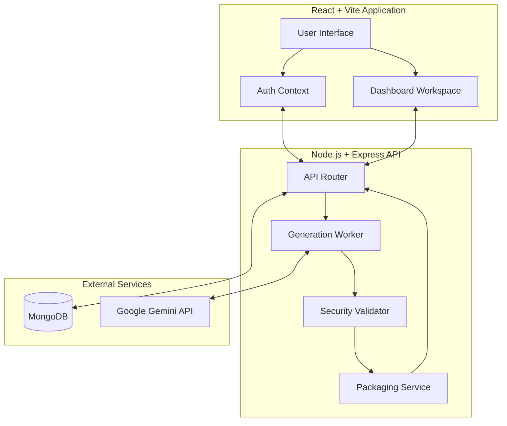
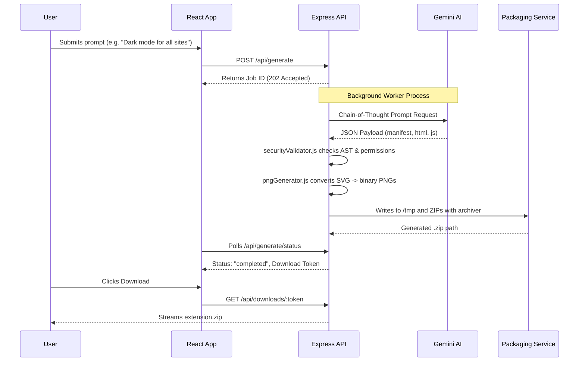

<div align="center">
   
   <h1>Extensio.ai - The No Code Extension Factory</h1>
   <h3>Empowering Creators to Build Browser Extensions with AI</h3>
</div>
<p  align="center">
  <a href="https://extensio-ai.vercel.app/">
    
  </a>
  <a href="https://extensio-ai.netlify.app/">
    
  </a> <br>
  
  
  
  
  
  
</p>

## 📖 Introduction

**Extensio.ai** (No-Code Extension Factory) is a revolutionary SaaS platform that democratizes browser extension development. It eliminates the coding barrier by transforming simple natural language requirements into fully functional, packaged Chrome Manifest V3 extensions in seconds.

**Extensio.ai** is a No-Code Extension Factory that empowers business users without coding knowledge to generate real, installable Chrome Extensions using natural language prompts.

### 🎯 Use Case
A business user types a requirement, such as: *"Make a Chrome extension that blocks all images on a website and replaces them with a red square."* The AI must generate all necessary files (`manifest.json`, `content.js`, `popup.html`), zip them and provide an immediate download link.

**Extensio.ai** immediately:
1.  **Analyzes** the intent using advanced LLM logic.
2.  **Generates** `manifest.json`, `content.js` and `popup.html`.
3.  **Packages** the files into a validated `.zip`.
4.  **Serves** a direct download file for immediate installation.

---

## 🚀 Product Features

*   **Auto-Packaging System:** A robust Node.js backend handles the entire workflow: receiving the code JSON, writing files to a secure temporary file system, creating a validated `.zip` archive using `archiver` and serving the download.
*   **Prompt Strategy:** Utilizes a highly structured "Chain of Thought" system prompt to force the LLM to output files in a required JSON format and to ensure generation of a valid Chrome V3 Manifest file.
*   **Access Control:** Users can securely save, manage, and iterate on their generated extension projects with basic version control, maintaining a full history of their workspace.
*   **AST Security Validation:** Strict screening of generated JavaScript to prevent malicious capabilities like `eval()` and `innerHTML` injections.

---

## 📅 Week-Wise Implementation Plan

This project was built following a rigorous 4-week development roadmap to ensure stability, security, and accuracy in the AI-generated code.

| Week | Goal | Key Tasks | Review / Verification |
| :--- | :--- | :--- | :--- |
| **Week 1** | **The Prompt Engineer**<br>*(Perfect Code Gen)* | Design the ultimate System Prompt to compel the LLM to output a structured JSON (Filename: Code Content). Test with simple requests ("Change background color"). | Rigorously verify the validity and parseability of the JSON output from the LLM. |
| **Week 2** | **File System & Zipping**<br>*(String to File)* | Implement Node.js logic: Read JSON → Write files to `/tmp` → Zip the folder (using `archiver`) → Serve the zip file. | **CRITICAL TEST:** Download the zip, install it manually in Chrome Developer Mode, and verify it functions. |
| **Week 3** | **The Platform UI**<br>*(Project Management)* | Build the dashboard for viewing past extensions. Implement the "Edit Request" feature. Implement subscription gating for "Advanced Features". | **Iteration Test:** Can the AI modify existing code based on a new prompt without introducing bugs? |
| **Week 4** | **Deployment & Security**<br>*(Finalization)* | Implement code sanitization on the AI output to prevent malicious code (security audit). Finalize and deploy the subscription flow. | Comprehensive security audit of the platform and the generated code. |

---
## 🏗 System Architecture

The platform uses a decoupled client-server architecture where the frontend handles state and UI, and the backend manages the heavy lifting of AI generation, validation and file packaging.


## 🏗️ Technical Architecture & System Flow

Extensio.ai follows a modern, decoupled architecture designed for high-speed generation and a premium user experience.


### Technology Stack Detail
*   **Frontend:** React (v18), Vite, Tailwind CSS (with highly customized utility classes for glassmorphism, gradients and micro-animations), React Router v6, Framer Motion.
*   **Backend:** Node.js, Express, MongoDB (Mongoose), `archiver` for `.zip` bundling, custom pure-JS zlib implementation for PNG generation.
*   **Security:** Helmet, express-rate-limit, custom AST-like `securityValidator.js` to block `eval()` and dangerous permissions.

---

## 📂 Project File Structure

The workspace is organized into a monorepo containing both the React frontend and the Node.js backend.

```text
extensio.ai/
├── backend/                  # Node.js + Express API
│   ├── controllers/          # Request handlers (auth, projects, admin)
│   ├── middlewares/          # Security, authentication & rate-limiting logic
│   ├── models/               # Mongoose MongoDB schemas
│   ├── routes/               # API endpoint definitions (api.js)
│   ├── services/             # Business logic (deployment, evolution etc.)
│   ├── workers/              # Background generation tasks (Gemini AI API calls)
│   ├── utils/                # Helper functions (pngGenerator, securityValidator, archiver)
│   ├── .env                  # Backend secrets (ignored in git)
│   └── index.js              # Express app entry point
│
├── frontend/                 # React + Vite Application
│   ├── src/
│   │   ├── components/       # Reusable UI components (buttons, modals)
│   │   ├── context/          # React Context (AuthContext)
│   │   ├── pages/            # Top-level route views (Dashboard, Login, Generator)
│   │   ├── assets/           # Static images and icons
│   │   ├── index.css         # Tailwind directives and custom CSS
│   │   └── App.jsx           # Main React Router setup
│   ├── public/               # Public static assets
│   ├── tailwind.config.js    # Tailwind configuration
│   └── vite.config.js        # Vite bundler configuration
│
└── README.md                 # You are here!
```

**Key Components Explained:**
*   **`backend/utils/pngGenerator.js`**: A custom utility to generate binary PNG icons on the fly without relying on heavy external dependencies like `canvas`.
*   **`backend/utils/securityValidator.js`**: Analyzes the generated code strings to ensure no malicious permissions or execution patterns (like `innerHTML` or `eval()`) are present before serving to the user.
*   **`backend/workers/generationWorker.js`**: Handles the long-running process of querying the Gemini AI model using a strict Chain-of-Thought system prompt to guarantee structured JSON output.
*   **`backend/index.js`**: The main server file where CORS, rate-limiting, and proxy trust settings are configured for production deployment on services like Render.

---

## ⚙️ Generation Workflow

When a user submits a prompt, the system executes a complex, multi-stage pipeline to ensure the resulting extension is safe, functional and ready to install.



---
## ✨ Core Features

### 🧩 Auto-Packaging System
The Node.js backend handles the entire workflow:
- **String to File:** Receives code JSON from the AI and writes it to a secure temporary file system.
- **Validated Archiving:** Uses the `archiver` library to create Chrome-compatible ZIP archives.
- **Immediate Serving:** Streamlined delivery of the generated package directly to the client.

### 🧠 Prompt Strategy (Chain of Thought)
Utilizes a highly structured **Chain of Thought** system prompt to:
- Force the LLM to output files in a required JSON format (`{ filename: content }`).
- Ensure strict adherence to **Chrome V3 Manifest** security and structural rules.
- Guarantee parseability and cross-component compatibility.

---

## 📡 Core API Reference

The backend exposes a comprehensive RESTful API for handling authentication, extension generation, and downloads.

### Authentication
*   `POST /api/auth/register`: Register a new user account.
*   `POST /api/auth/login`: Authenticate and receive a JWT.
*   `GET /api/auth/me`: Get current authenticated user profile.

### Projects & Generation
*   `GET /api/projects`: List all generated extension projects for the user.
*   `POST /api/generate`: Submit a new extension generation prompt. Returns a `jobId`.
*   `GET /api/generate/status/:jobId`: Poll the background generation status. Returns "completed" and a download token upon success.
*   `POST /api/generate/advanced`: (Premium) Submit an advanced prompt allowing API calls and complex background scripts.
*   `DELETE /api/projects/:projectId`: Delete a project and its history.

### Delivery
*   `GET /api/downloads/:token`: Stream the generated `.zip` extension bundle directly to the browser.

---

## 💻 Local Setup & Development

### Prerequisites
*   Node.js (v18+)
*   MongoDB (Local instance or MongoDB Atlas)
*   Gemini API Key
*   Git


### MongoDB Atlas Setup
1. Create a free cluster on [MongoDB Atlas](https://www.mongodb.com/cloud/atlas).
2. Under "Database Access", create a user with read/write privileges.
3. Under "Network Access", allow IP access (e.g., `0.0.0.0/0` for development).
4. Get your connection string (URI) starting with `mongodb+srv://...`.
5. Create a database named `extensio`.

### 1. Clone & Install
```bash
git clone https://github.com/suryanshsingh07/extensio.ai.git
cd extensio.ai
```

### 2. Backend Setup
```bash
cd backend
npm install
```
Create a `.env` file in the `backend` directory:
```env
PORT=5000
MONGO_URI=mongodb://localhost:27017/extensio
JWT_SECRET=your_super_secret_jwt_key
GEMINI_API_KEY=your_gemini_api_key
NODE_ENV=development
```
Start the backend server:
```bash
npm run dev
```

### 3. Frontend Setup
```bash
cd ../frontend
npm install
```
Create a `.env` file in the `frontend` directory:
```env
VITE_SERVER_URL=http://localhost:5000
```
Start the frontend development server:
```bash
npm run dev
```

---

## 🔒 Security Best Practices Implemented
*   **Proxy-Aware Rate Limiting:** The backend utilizes `app.set('trust proxy', 1)` to correctly rate-limit bad actors by their true IP address, rather than blocking the reverse proxy.
*   **AST Validation:** No `innerHTML`, `eval()`, or dynamic code execution is permitted in the generated extensions. 
*   **Hardcoded Secrets Removed:** All administration accounts and static tokens have been removed from the source tree.

---

## 🗺 Roadmap & Future Enhancements
*   **Direct Chrome Web Store Publishing:** Allow premium users to publish their generated extensions directly to the Google Chrome Web Store via OAuth 2.0 API integration.
*   **Collaborative Workspaces:** Enable teams to co-edit extension prompts and share generated artifacts.
*   **WebAssembly Components:** Allow the AI to scaffold heavy computational extensions (e.g., image manipulation) using Rust compiled to Wasm.
*   **Automated E2E Testing:** Automatically spawn a headless Puppeteer browser to verify extension UI and logic *before* delivering the `.zip` to the user.

---

<div align="center">
  <p>© 2026 - All rights reserved</p>
  <p><i>The next generation of browser extension development</i></p>
</div>