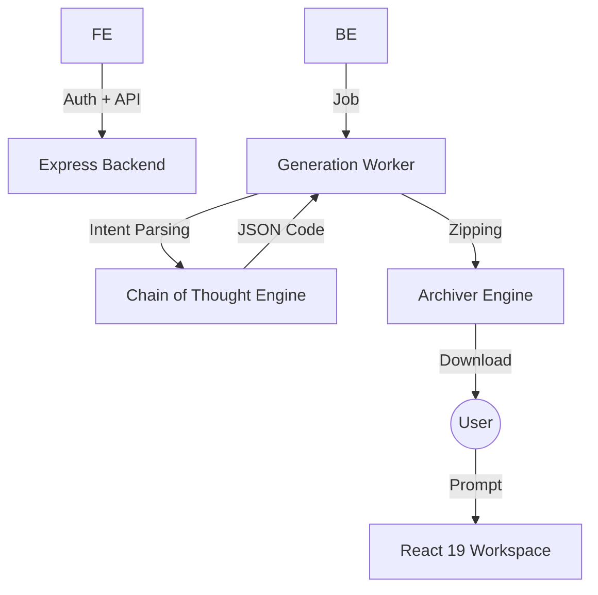

<div align="center">
   
   <h1>Extensio.ai - The No Code Extension Factory</h1>
   <h3>Empowering Creators to Build Browser Extensions with Ai<h3>
</div>
<p  align="center">
  <a href="https://extensio-ai.vercel.app/">
    
  </a>
  <a href="https://extensio-ai.netlify.app/">
    
  </a> <br>
  
  
  
  
  
  
</p>

## 📖 Introduction

**Extensio.ai** (No-Code Extension Factory) is a revolutionary SaaS platform that democratizes browser extension development. It eliminates the coding barrier by transforming simple natural language requirements into fully functional, packaged Chrome Manifest V3 extensions in seconds

### 🎯 Use Case
A user types:- *"Make a Chrome extension that blocks all images on a website and replaces them with a red square"*
**Extensio.ai** immediately:-
1.  **Analyzes** the intent using advanced LLM logic
2.  **Generates** `manifest.json`, `content.js` and `popup.html`
3.  **Packages** the files into a validated `.zip`
4.  **Serves** a direct download file for immediate installation

## 🏗️ Technical Architecture & System Flow

Extensio.ai follows a modern, decoupled architecture designed for high-speed generation and a premium user experience



## 📂 Project File Structure

The project is organized into a clean mono-repo structure for ease of development and deployment

```text
extensio.ai/
├── frontend/               # React 19 + Vite Workspace
│   ├── src/
│   │   ├── components/     # UI Components (Hero, Dashboard etc.)
│   │   ├── context/        # Auth & App State
│   │   ├── config.js       # Global API Configuration
│   │   └── index.css       # Premium Design System (Tailwind 4)
│   ├── vercel.json         # Vercel Deployment Config
│   ├── netlify.toml        # Netlify Deployment Config
│   └── package.json
├── backend/                # Node.js + Express API
│   ├── controllers/        # Route Handlers (Download, Project)
│   ├── routes/             # API Endpoint Definitions
│   ├── workers/            # AI Generation Logic (The Brain)
│   ├── services/           # DB Interactions
│   ├── models/             # Mongoose Schema (User, Project)
│   └── index.js            # Entry Point
├── README.md               # Detailed Documentation
└── .gitignore              # Global Security & Ignore Rules
```
## ✨ Core Product Features

### 🧩 Auto-Packaging System
The Node.js backend handles the entire workflow:-
- **String to File:-** Receives code JSON from the AI and writes it to a secure temporary file system
- **Validated Archiving:-** Uses the `archiver` library to create Chrome-compatible ZIP archives
- **Immediate Serving:-** Streamlined delivery of the generated package directly to the client

### 🧠 Prompt Strategy (Chain of Thought)
Utilizes a highly structured **Chain of Thought** system prompt to:-
- Force the LLM to output files in a required JSON format (`{ filename: content }`)
- Ensure strict adherence to **Chrome V3 Manifest** security and structural rules
- Guarantee parseability and cross-component compatibility

## 🛠️ Setup & Installation

### Prerequisites
- **Node.js** (v18 or higher)
- **MongoDB Atlas Account** (Free tier works)
- **Git**

### 1. MongoDB Atlas & Vector Search Setup
1. Create a free cluster on [MongoDB Atlas](https://www.mongodb.com/cloud/atlas)
2. Under "Database Access", create a user with read/write privileges
3. Under "Network Access", allow IP access (e.g., `0.0.0.0/0` for development)
4. Get your connection string (URI) starting with `mongodb+srv://...`
5. Create a database named `extensio` and a collection named `chunks`
6. Go to the **Atlas Search** tab, click **Create Search Index**, choose **Atlas Vector Search** (JSON Editor), select the `extensio.chunks` collection, and use the following configuration:-
   ```json
   {
     "fields": [
       {
         "numDimensions": 768,
         "path": "embedding",
         "similarity": "cosine",
         "type": "vector"
       }
     ]
   }
   ```
   *Note:- Name the index `vector_index`.*

### 2. Backend Setup
1. Open a terminal and navigate to the backend directory:-
   ```bash
   cd backend
   ```
2. Install dependencies:
   ```bash
   npm install
   ```
3. Create a `.env` file in the `backend` directory with the following variables:
   ```env
   NODE_ENV=development
   PORT=5000
   MONGO_URI=your_mongodb_connection_string_here
   JWT_SECRET=your_super_secret_jwt_key
   ```
4. Start the backend server:-
   ```bash
   npm run dev
   ```
   *The backend will run on `http://localhost:5000`*

### 3. Frontend Setup
1. Open a new terminal and navigate to the frontend directory:-
   ```bash
   cd frontend
   ```
2. Install dependencies:-
   ```bash
   npm install
   ```
3. *(Optional)* If your backend is running on a different port, update the API URL in `frontend/src/services/api.js`. It defaults to `http://localhost:5000`
4. Start the frontend development server:-
   ```bash
   npm run dev
   ```
   *The frontend will run on `http://localhost:5173`*

## 🚀 How to run locally

To run the full stack, you need both servers running simultaneously

1. **Terminal 1**: 
   ```bash
   cd backend
   npm run dev
   ```
2. **Terminal 2**: 
   ```bash
   cd frontend
   npm run dev
   ```
3. Open your browser and navigate to `http://localhost:5173`.
4. **Usage Workflow**:
   - Create an account on the **Sign Up** page
   - Go to the **Chat** interface and type which extension does you want
   - Wait for the extensio.ai to finish processing
   - download the extension locally!

## 🛡️ Security & Privacy
Extensio.ai implements strict security policies. All generated extensions are limited to requested host permissions. The platform utilizes **JWT authentication** to ensure user data isolation and **Helmet.js** for secure HTTP headers. **.gitignore** is configured to prevent the leakage of sensitive `.env` files

---

<div align="center">
  <p>© 2026 - All rights reserved</p>
  <p><i>The next generation of browser extension development</i></p>
</div>
